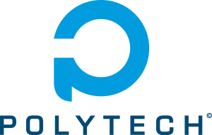

#Projet Hyblab 2022 - Polytech Nantes / AGR

Du 11 janvier 2022 au 4 février 2022

 

###Porteur de projet : 
Julien Kostreche directeur de Ouest Medialab

###Sujet : Sondages
L'objectif du projet est d'afficher les résultats des sondages à l'élection présidentielle Française de 2022
d'une manière différente que ce qui existe déjà.

###Nom d'équipe : Genesis
L'équipe est composée d'étudiants de l'AGR (école de design) chargé de travailler sur le graphisme de l'application
et d'étudiants de Polytech Nantes (école d'ingénieur) chargé de développer l'application.

##Participants : 

- AGR : 
  - Timothée Guitton [Instagram](https://www.instagram.com/tim_skern/?hl=fr), 
  - Angèle Renaudin [Instagram](https://www.instagram.com/mooneow/?hl=fr)

- Polytech :  
  - Josik Sallaud [Linkedin](https://www.linkedin.com/in/josik-sallaud/), 
  - Nathan Rocher [Linkedin](https://www.linkedin.com/in/nathan-rocher/), 
  - Mattéo Boursault [Linkedin](https://www.linkedin.com/in/mattéo-boursault-485b30227/), 
  - Adame Naji [Linkedin](https://www.linkedin.com/in/adame-naji/), 
  - Henri Fakhouri [Linkedin](https://www.linkedin.com/in/henri-fakhouri-6618a6125/)

## Sources : 
La source des données de ce projet provient du repos Git NSPPolls qui compile les résultats des sondages à l'occasion des 
élections régionales et présidentielle en France. 
[Lien GitHub nsppolls](https://github.com/nsppolls/nsppolls)

## Repos officiel du projet: 
https://github.com/Hyblab-2022-Genesis/Hyblab2022

## Instructions de lancement

Pour installer toutes les dépendances nécessaires au lancement du projet :

`npm install`

Pour lancer le serveur Node en local : 

`npm start`

Pour accéder à l'application en local, veuillez vous rendre à l'adresse suivante : 

`localhost:8080/sondages/`

L'application est disponible à l'adresse suivante : 

`https://hyblab.polytech.univ-nantes.fr/sondages/`

## Traitement des données : 

Afin d'afficher correctement les résultats des sondages, nous faisons trois choix de traitement. 
- Si un candidat est présent dans plusieurs sondages sur une même journée, on fait une moyenne de ces sondages pour la dite 
journée. 
- Si un candidat n'est pas sur les résultats d'un sondage au jour n, on estime avec une fonction affine l'intention de 
vote du jour avec des résultats des sondages des jours n-1 et n+1. 
- Afin de corriger les micros variation et d'afficher une course moins saccadée, nous faisons une regression locale sur les 
résultats des sondages. https://fr.wikipedia.org/wiki/R%C3%A9gression_locale

